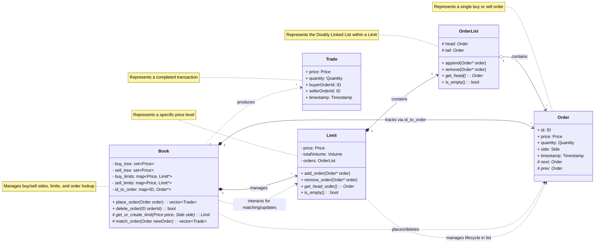
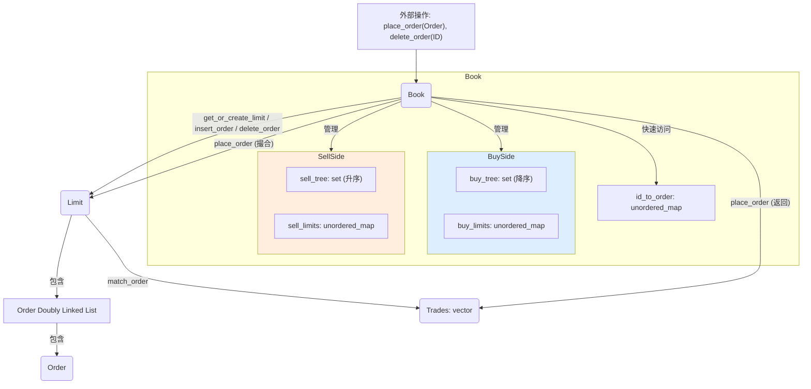

# OrderBook 项目入门指南

## 1. 项目目标

该项目旨在实现一个高性能的**限价订单簿 (Limit Order Book, LOB)** 及其**撮合引擎 (Matching Engine)**。目标是为模拟高频交易环境提供一个高效、健壮的基础设施。

## 2. 核心概念

*   **限价订单簿 (LOB)**: 一个按价格排序的买单 (Bids) 和卖单 (Asks) 列表。买单按价格从高到低排序，卖单按价格从低到高排序。
*   **撮合引擎**: 负责将新进入的订单与订单簿中已有的、价格匹配的对手方订单进行成交（撮合）的机制。
*   **价格优先、时间优先 (Price-Time Priority)**: 订单撮合的基本原则。
    *   **价格优先**: 买单价格越高越优先，卖单价格越低越优先。
    *   **时间优先**: 在相同价格下，先进入订单簿的订单优先成交。

## 3. 系统架构

### 3.1 主要类

*   **`Order` (`Order.h`, `Order.cpp`)**: 代表一个单独的订单。
    *   包含属性：`id`, `agent_id`, `type` (BUY/SELL), `price`, `initial_volume`, `volume` (剩余数量), `status` (ACTIVE/FULFILLED/DELETED)。
    *   包含 `prev` 和 `next` 指针 (`OrderPointer`)，用于在同一价格水平形成双向链表。
*   **`Limit` (`Limit.h`, `Limit.cpp`)**: 代表订单簿中的一个特定价格水平。
    *   包含属性：`price`, `length` (订单数), `total_volume` (总剩余数量)。
    *   包含 `head` 和 `tail` 指针 (`OrderPointer`)，指向该价格水平订单链表的头和尾。
    *   关键方法：`insert_order` (按时间顺序插入), `delete_order`, `match_order` (执行撮合)。
*   **`Trade` (`Trade.h`)**: 代表一次成功的撮合（成交）。
    *   包含属性：`incoming_order` (新订单ID), `matched_order` (被撮合订单ID), `price`, `volume`。
*   **`Book` (`Book.h`, `Book.cpp`)**: 订单簿的核心管理者。
    *   管理买方 (`buy_tree`, `buy_limits`) 和卖方 (`sell_tree`, `sell_limits`) 的所有价格水平 (`Limit`)。
    *   维护最佳买价 (`best_buy`) 和最佳卖价 (`best_sell`)。
    *   提供 `place_order` 和 `delete_order` 作为主要外部接口。
    *   包含一个 `id_to_order` 的映射，用于快速通过 ID 查找订单。

### 3.2 数据结构

*   **订单存储 (同一价格)**: 在每个 `Limit` 对象内部，订单通过 `OrderPointer` (即 `std::shared_ptr<Order>`) 组成的**双向链表**存储，确保了时间优先。`head` 指向最早的订单，`tail` 指向最新的订单。
*   **价格水平管理**:
    *   `Book` 类使用 `std::set<Price>` (`buy_tree`, `sell_tree`) 来存储所有存在订单的价格水平。`std::set` (通常基于红黑树) 保证了价格的有序性（买价降序，卖价升序），便于快速找到最佳买卖价和进行价格区间的撮合。
    *   `Book` 类同时使用 `std::unordered_map<Price, LimitPointer>` (`buy_limits`, `sell_limits`) 将价格映射到对应的 `Limit` 对象指针，提供了通过价格快速访问特定 `Limit` 对象的能力。
*   **订单快速查找**: `Book` 类使用 `std::unordered_map<ID, OrderPointer>` (`id_to_order`) 存储所有活跃订单的 ID 到其 `OrderPointer` 的映射，使得通过订单 ID 进行删除或状态查询的操作非常高效。

### 3.3 结构图

4. 关键功能流程
下单 (Book::place_order):
接收一个 OrderPointer。
检查订单类型 (BUY/SELL)。
撮合:
如果是 BUY 单，则从 sell_tree 的最低价 (best_sell) 开始向上查找是否有价格小于等于该 BUY 单价格的 Limit。
如果是 SELL 单，则从 buy_tree 的最高价 (best_buy) 开始向下查找是否有价格大于等于该 SELL 单价格的 Limit。
如果找到可撮合的 Limit，调用该 Limit 的 match_order 方法。
Limit::match_order 会按时间优先（从 head 开始）遍历其订单链表，与传入订单进行撮合，生成 Trade 记录，并更新相关订单的 volume 和 status。如果 Limit 中的订单被完全成交，会将其从链表中移除。
重复此过程，直到新订单完全成交，或者订单簿中没有更多可匹配的对手方订单。
插入: 如果新订单在撮合后仍有剩余数量 (volume > 0)，则调用 insert_order 方法：
使用 get_or_create_limit 获取或创建对应价格的 Limit 对象。
调用该 Limit 对象的 insert_order 方法，将订单添加到链表尾部。
更新 buy_tree/sell_tree 和 buy_limits/sell_limits。
将订单信息存入 id_to_order 映射。
更新 best_buy/best_sell。
返回撮合过程中产生的所有 Trade 记录 (Trades)。
撤单 (Book::delete_order(ID id)):
使用 id_to_order 查找订单 ID 对应的 OrderPointer。
如果找到且订单状态为 ACTIVE：
获取订单的价格和类型。
从 buy_limits 或 sell_limits 中找到对应的 LimitPointer。
调用该 Limit 对象的 delete_order 方法，将订单从其内部链表中移除。
更新 Limit 的 length 和 total_volume。
调用 check_for_empty_buy_limit 或 check_for_empty_sell_limit 检查该价格水平是否变空。如果变空，则从 buy_tree/sell_tree 和 buy_limits/sell_limits 中移除该 Limit。
从 id_to_order 中移除该订单。
更新 best_buy/best_sell (如果被删除的是最优价格订单)。
将订单状态设置为 DELETED。
5. 基础数据类型 (Types.h)
定义了如 ID, Price, Volume, Length 等基本类型别名，以及 OrderType (BUY/SELL) 和 OrderStatus (ACTIVE/FULFILLED/DELETED) 枚举。

6. 如何运行与演示
代码入口: main.cpp 可能是主要的 C++ 程序入口点，它会创建 Book 对象并处理输入。
演示数据: demo 目录下包含：
generate_orders.py: 用于生成大量模拟订单操作的 Python 脚本。
sample_operations.csv: 脚本生成的 CSV 文件示例，包含订单操作（格式如 ID,AgentID,Price,Volume 用于添加，或仅 ID 用于删除）。
demo.cpp: 可能是一个使用 Book 类处理 CSV 文件的示例程序。
plot_order_book.py: 可能用于可视化订单簿状态。
final_order_book.csv/.png: 演示运行后的最终订单簿状态或其可视化结果。
运行流程:
使用 generate_orders.py 生成订单操作 CSV 文件。
编译并运行 C++ 程序（可能是 main.cpp 或 demo.cpp），将 CSV 文件作为输入。
程序会处理这些操作，模拟订单簿的动态变化和撮合过程。
7. 构建项目
项目根目录及 src, demo, tests 目录下均包含 CMakeLists.txt 文件，表明项目使用 CMake 进行构建。你需要安装 CMake 和 C++ 编译器（如 g++ 或 clang）来编译项目。通常的构建步骤是：

mkdir build
cd build
cmake ..
make
(具体命令可能因环境而异)

8. 测试
tests 目录包含了项目的单元测试。

OrderBookTest.cpp: 针对 Book, Limit, Order 等核心功能的测试用例。
tests/lib: 包含了 Google Test 和 Google Mock 测试框架，用于编写和运行测试。运行测试通常在构建后执行类似 make test 或直接运行测试可执行文件。

