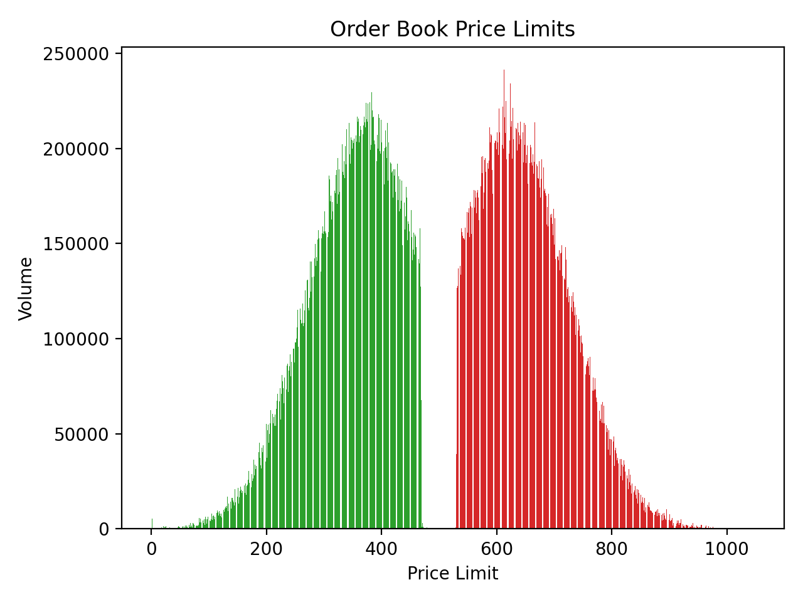

# 限价订单簿与撮合引擎

本项目包含一个高性能的限价订单簿（Limit Order Book）及其撮合引擎的C++实现。

<p align="center" width="100%">
     
</p>

## 项目概述

限价订单簿通过结合多种数据结构来优化订单的插入、删除和撮合操作：

### 系统架构

- **数据结构**: 订单存储在双向链表结构中，每个链表代表一个价格水平。价格水平通过C++中的`std::set`实现的红黑树进行管理，确保高效的插入和删除操作。

- **订单格式**: 订单按照`ID, AgentID, Price, Volume`格式添加，按照`ID`进行删除。

### 性能表现

为了评估性能，系统使用Python脚本生成的1,000,000个操作（下单或撤单）进行测试。这些操作通过CSV解析器处理并输入到C++程序中。

- **高性能**: 系统实现了平均(订单总数1m-4m)**2,000,000次操作/秒**的峰值性能(i5-13500hx 开启O2优化)。操作包括订单插入、交易撮合和订单删除。

## 演示与使用

演示可参考[Python脚本](demo/generate_orders.py)用于生成订单和相应的CSV文件。该文件作为C++程序的输入，展示了高效处理大规模订单操作的能力。

## 构建与运行

```bash
# 构建项目
mkdir build && cd build
cmake -DCMAKE_BUILD_TYPE=Release ..
cmake --build . --parallel

# 运行主程序
./OrderBook_run

# 运行测试
./tests/Google_Tests_run
```

## 核心技术特性

- **价格-时间优先**: 实现标准的价格优先、时间优先撮合规则
- **内存池优化**: 使用Boost对象池减少内存分配开销
- **高效数据结构**: 红黑树管理价格水平，哈希表实现快速订单查找
- **零拷贝设计**: 关键路径使用原始指针避免不必要的对象拷贝

## 参考资料

1. [How to Build a Fast Limit Order Book](https://web.archive.org/web/20110410160306/http://howtohft.wordpress.com:80/2011/02/15/how-to-build-a-fast-limit-order-book) - 高性能限价订单簿设计思路

---

本项目展示了一个为高频交易环境优化的限价订单簿与撮合引擎的稳健实现。
