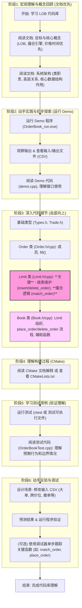
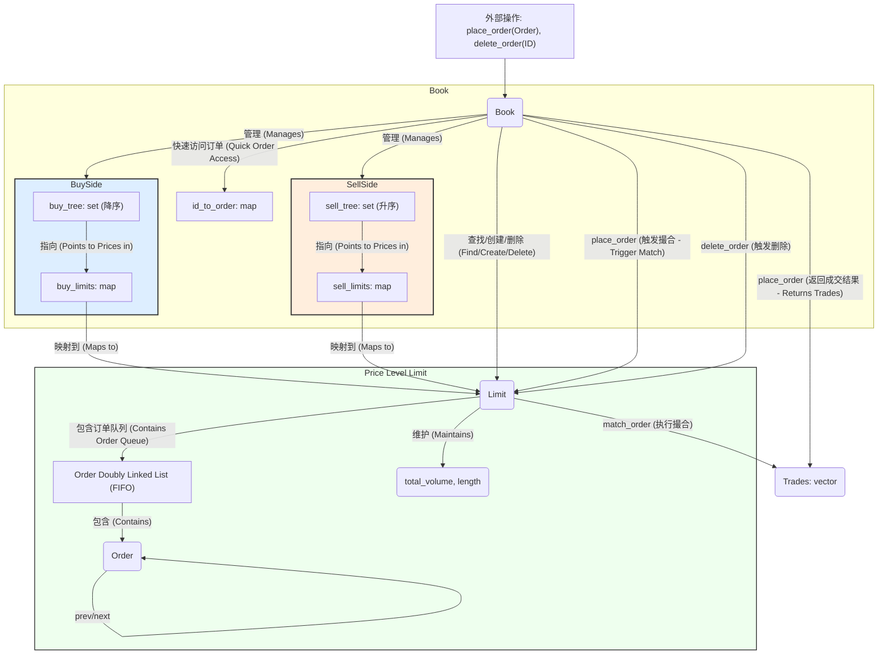

好的，根据您提供的文本内容，这是一个逐步理解和学习 Limit Order Book (LOB) 和撮合引擎代码库的建议流程。我将使用 Mermaid 的 Flowchart (流程图) 来可视化这个学习路径。

这个流程图展示了从宏观概念理解开始，逐步深入到代码细节、构建过程、测试，最后通过实验和调试来巩固理解的学习和探索步骤。

**图表说明:**

1.  **阶段1: 宏观理解与概念回顾**: 从阅读项目文档开始，建立对项目目标、核心概念（如 LOB、撮合引擎、价格时间优先原则）和整体架构（主要类及其关系、数据结构）的理解。这是后续深入代码的基础。
2.  **阶段2: 动手实践与初步探索**: 通过运行提供的 Demo 程序，直观感受系统的输入、输出和基本功能。阅读 Demo 代码有助于了解 `Book` 类等核心接口是如何被实际调用的。
3.  **阶段3: 深入代码细节 (自底向上)**: 这是代码学习的核心环节。按照从基础到复杂的顺序（Types -> Order -> Limit -> Book）阅读代码。
    *   **特别注意**: `Limit` 类及其 `match_order` 方法是撮合引擎的核心逻辑所在，需要重点理解（图表中已用颜色突出显示）。
    *   理解 `Book` 类如何协调 `Limit` 对象，处理订单的接收、撮合和簿记。
4.  **阶段4: 理解构建过程**: 了解项目是如何通过 CMake 进行编译和链接的，有助于理解代码组织和依赖关系。
5.  **阶段5: 学习测试用例**: 测试代码是理解类预期行为、功能边界和使用方式的绝佳资源。通过运行和阅读测试，可以验证自己对代码的理解是否正确。
6.  **阶段6: 动手实验与调试**: 这是主动学习和加深理解的步骤。通过修改输入数据、预测并验证结果，可以更深入地掌握系统行为。在遇到问题或需要细致了解执行流程时，使用调试器进行单步跟踪是非常有效的方法。
7.  **结束**: 完成上述所有步骤后，应该对该 LOB 和撮合引擎代码库有了比较全面的理解。

这个流程图清晰地展示了推荐的学习路径，从高层概念到底层实现，再到实践验证，帮助您系统地掌握代码库。

